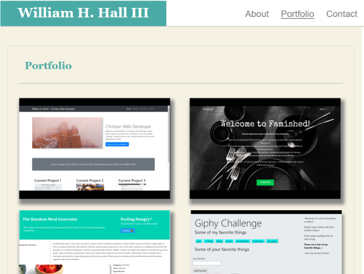

# Bootstrap-Portfolio
This my basic portolio redone with bootstrap

## Screenshot

## Purpose

To become familiar with the Bootstrap CSS framework. 

## Usage

The user can see samples of the work that I have done, as well as find contact information and biographical information as well.

## Languages/Frameworks Used

html, css, Bootstrap, Visual Studio Code, Git, Github pages
